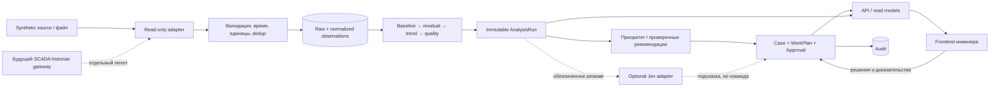

# Архитектура и границы модулей

Все положения, кроме явно отмеченных ссылкой на слайд, — предложение для MVP. Не является утверждённым ТЗ или промышленным проектом АСУ.

## 1. Базовое решение

**Отдельный frontend + модульный backend-монолит + вычислительный worker.** Не превращать каждый блок в микросервис. Чёткая граница модуля не требует отдельного контейнера или отдельной базы.

Рекомендуемый стек: React + TypeScript + Vite; общий UI-kit на доступных primitives, таблицы TanStack Table, серверный state TanStack Query, Apache ECharts для рядов; FastAPI + Pydantic; PostgreSQL + SQLAlchemy/Alembic; численное ядро Python; pytest и Playwright. Зафиксировать совместимые версии на этапе 01, сохранить lockfiles. Это выбор реализации, а не набор технологий из презентации.

FastAPI выбран для общей Python-обработки и генерации OpenAPI/JSON Schema: https://fastapi.tiangolo.com/features/ . Framework обеспечивает описание API, но не готовую бизнес-логику или защиту OT.

MVP запускается Docker Compose локально; frontend статикой через один reverse proxy, `/api` в backend, worker из того же Python-пакета. База и внутренний worker не публикуют порты наружу. Локальное хранение приложений в отдельном volume; S3/MinIO, Redis, Kafka и Kubernetes пока не нужны. Фоновые задания можно хранить в PostgreSQL с блокировкой и повторными попытками; периодический worker достаточен для демонстрационных 5-минутных измерений.

## 2. Поток данных

Ни одна стрелка из аналитического приложения не идёт к исполнительному аппарату. Подготовка документа в workflow не является командой физическому устройству.

## 3. Модули и владельцы

| Модуль / каталог после scaffold | Ответственность | Запрещено |
|---|---|---|
| `packages/domain_contracts` | Канонические DTO и переходы, экспорт OpenAPI | Менять контракт в ветке одного feature без согласования |
| `packages/ingestion` | CSV/replay adapter, проверки, нормализация | Читать ground truth для диагностики |
| `packages/diagnostics` | Чистые функции baseline/residual/trend/quality/policy | HTTP, БД, LLM, принятие решения за человека |
| `apps/api` | Auth, RBAC, persistence, API, workflow/audit | Дублировать расчёты frontend/worker |
| `apps/worker` | Запуск analysis jobs, идемпотентность, snapshots | Самовольно подтверждать дефект/утверждать работу |
| `apps/web/src/design-system`, `shell` | Tokens, компоненты, навигация, бренд | Бизнес-формулы/новые статусы |
| `apps/web/src/features` | Три экрана, доказательства, планы, API state | Собственный независимый источник «истины» |
| `packages/decision_adapters` | Опциональный Jev, timeouts, allowlist | Команды, изменение чисел/прав/уставок |
| `tests/e2e`, `verification` | Независимая приёмка | Объявлять эксплуатационную точность по синтетике |

## 4. Данные и идентичность

`Asset`: стабильный id, тип, площадка, родитель, паспортные атрибуты; не кодировать текущий риск в паспорте.

`Source`: измеряемая величина, место, единицы, частота/событийность, freshness policy. `Measurement`: eventTime, receivedAt, sourceId, metric, value/null, quality, dedup key. Raw неизменяем; исправленная интерпретация — новая версия нормализации.

`AnalysisRun`: assetId, scenarioRunId, asOf, inputWindow, inputSnapshotHash, modelVersion, policyVersion, quality, residual, trend, support/counterevidence, recommendation codes. Результат immutable. Любой UI-агрегат указывает его id; разные версии не смешиваются на одной карточке незаметно.

`Case`: связь с asset, причина открытия, текущая стадия, назначение, история анализов. Аномалия не создаёт новый case каждые 5 минут: открытый случай агрегирует одинаковую семью симптомов по `(scenarioRunId, assetId, symptomFamily)`; стратегия merge описана и протестирована.

`Evidence`: origin, автор/устройство, observedAt, receivedAt, verification, hash файла/измерения, версия; приложенный текст считается недоверенными данными, не инструкцией агенту.

`WorkPlan`: caseId, analysisRunId, evidenceRevision, автор, шаги, состояние, ревизия. `Approval`: актор, действие, время, утверждённая ревизия, основание. `Defect`: создаётся только после отдельного человеческого подтверждения; связан с кейсом, но не тождественен ему.

`AuditEvent`: actorId, действие, objectId, прежняя/новая revision, timestamp, requestId. В MVP журнал append-only на уровне приложения; это не сертифицированное неизменяемое хранилище. Для пилота отдельно задаются доступ администратора БД, retention и резервирование.

`ScenarioRun`: seed, набор данных, виртуальное время, режим, изоляция. Все stateful сущности DEMO привязаны к run, чтобы reset не смешивал разные демонстрации.

## 5. Переходы и права

### Случай

`detected → under_review → awaiting_evidence → confirmed | not_confirmed | sensor_issue`.

`confirmed → remediation_planned → verification → closed`.

`not_confirmed | sensor_issue → verification → closed` при указанном исходе и результатах. Допускается возврат `verification → under_review`, если данные снова противоречивы. Начальное автоматическое обнаружение разрешено, подтверждение/закрытие — только человеку. Конкретные переходы интегратор фиксирует в модели и тестах до работы feature-агентов.

### План

`draft → submitted → approved | rejected`.

`rejected → draft` создаёт новую ревизию; `approved → in_progress → awaiting_verification → completed`. `superseded/cancelled` требуют причины. Новый анализ после submitted показывает stale-review; нельзя утвердить план, не указав, что проверена актуальная evidenceRevision. Политика допуска исторического плана не должна молча перепривязывать его.

### Роли

- `viewer`: чтение разрешённых активов, без mutations.
- `engineer`: разбор случая, подготовка проекта, добавление заключения; подтверждение дефекта только с отдельным permission.
- `approver`: согласование проекта и значимых исходов.
- `technician`: результаты назначенных шагов, без изменения исходных измерений и согласований.
- `admin`: пользователи/конфигурация; не автоматически инженерные полномочия.

В локальной демонстрации seeded-пользователи с паролями из `.env`, видимое обозначение DEMO; backend выполняет реальную проверку роли. Не доверять `role=approver`, пришедшему из браузера. Режим без auth допустим только для read-only UI sandbox, не для финальной демонстрации согласований. Для реального предприятия OIDC/корпоративные роли — отдельная интеграция.

## 6. Общие API-правила

Префикс `/api/v1`. UTC ISO8601, числа без локализованной запятой, явные единицы, null вместо отсутствующего измерения. `schemaVersion` в устойчивых документах. Пагинация и ограничение числа точек. Генерация TS из канонического OpenAPI, а не поддержка двух вручную написанных наборов DTO.

Mutations имеют `expectedRevision` и `Idempotency-Key`; конфликт версии — 409; неверный переход — 422; недостающая роль — 403. Отправка плана и запись audit происходят в одной транзакции. API-ошибка: `code, message, details, requestId`, без стека/секретов.

Начальная спецификация в `contracts/` фиксирует измерение и структурированный анализ, маршруты — в `contracts/README.md`. Это **не готовый полный OpenAPI сервер**. Этап 01 обязан дополнить workflow-схемы и заморозить OpenAPI перед параллельной реализацией. Изменения документируются RFC, не договариваются устно между двумя агентами.

Для MVP разрешён polling каждые 5 секунд; сервер не пересчитывает всё по запросу страницы. SSE можно добавить на этапе интеграции для `analysis.updated`, `case.updated`, `plan.updated` с eventId и полной resync после reconnect. WebSocket не нужен для обычной read-mostly витрины.

## 7. Время и сценарии

Сервис `Clock` даёт либо виртуальное время DEMO, либо системное время будущей интеграции. Расчёт использует только наблюдения с `eventTime <= asOf`, доступные к `receivedAt <= replayReceivedAt`, с явной политикой поздних измерений. Данные будущего не попадают в прогноз.

Playback speed изменяет скорость поступления исторических наблюдений, а не их физические timestamps. Окно 24 часа остаётся 24 часами данных при скорости ×60. Перемотка назад создаёт новый scenarioRunId; audit старого run не переписывается.

REFERENCE-режим использует curated fixtures с явным источником. SIMULATION использует generator → adapter → analysis → API. Нельзя заменить второй путь тем же JSON с анимацией чисел.

## 8. Реальный объект — последующая граница

Предпочитать чтение из существующего historian/SCADA через согласованный gateway. OPC UA, MQTT, REST, IEC 60870-5-104/61850 относятся к вариантам интеграции, не к обязательству писать все драйверы. Нативные IEC-протоколы через проверенное промышленное ПО/шлюз, не из браузера.

До подключения: перечень тегов/единиц, clock sync, качество/частота, модель asset mapping, доступ только на чтение, зоны сети, outage handling, объём/retention, журналирование, backup/restore и инженерная валидация. Основная справочная рамка OT: NIST SP 800-82 Rev.3, https://csrc.nist.gov/pubs/sp/800/82/r3/final . Это ориентир исследования, не заявление о соответствии системы.

В MVP никаких OT-учётных данных, discovery промышленной сети или write SDK. Внешний AI отключён по умолчанию; корпоративные документы/теги не отправляются во внешний сервис без отдельного разрешения.

## 9. Расширения

Новый тип оборудования добавляет plugin-обработчик по явному протоколу `analyze(observations, assetContext, policy) -> AnalysisResult`. Для выключателя анализ событий, для кабеля — своя методика; не переиспользовать тепловую формулу как универсальный ИИ.

Будущие модули `defects`, `load_forecast`, `what_if`, `director`, `documents`, `topology` используют общие assets/evidence/roles/audit. Их расчётные ядра и сценарии независимы. Контур управления из слайда 25 остаётся отдельным проектом, не планируемым «переключателем» этого советчика.
